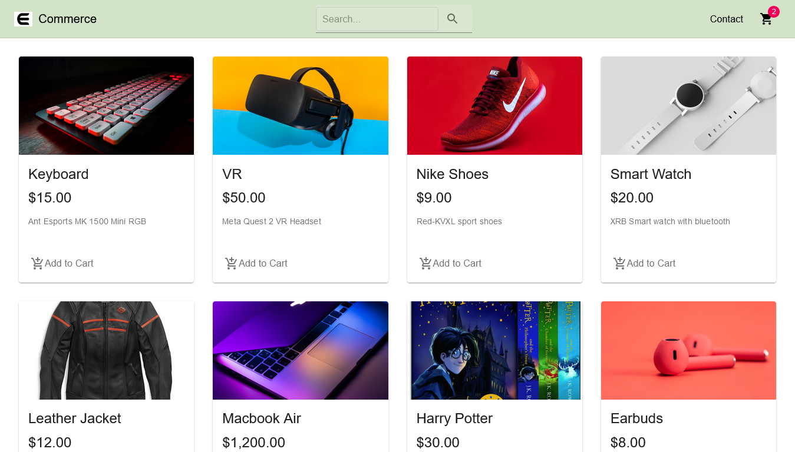
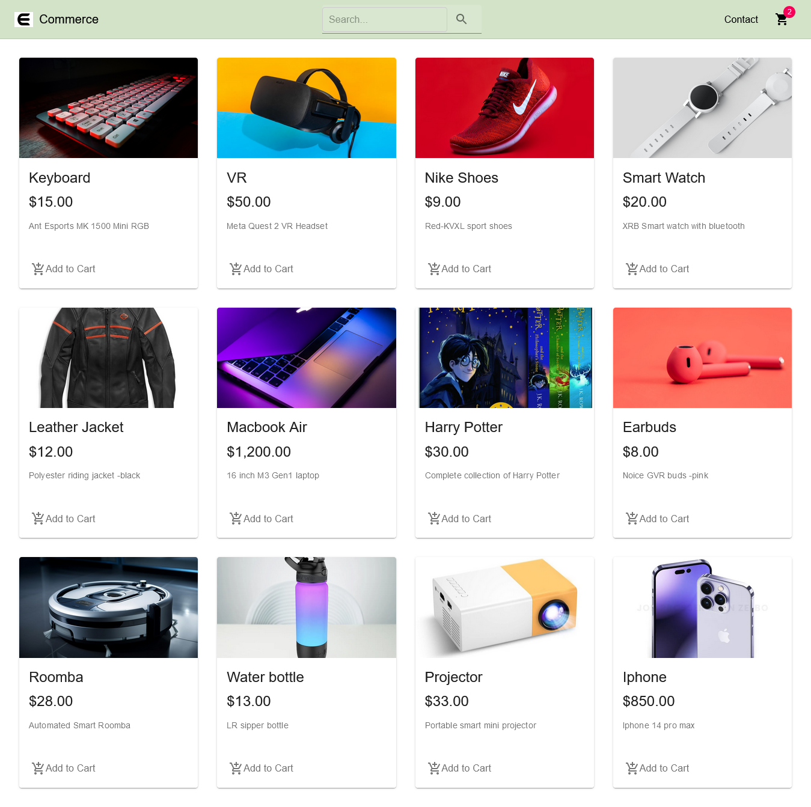
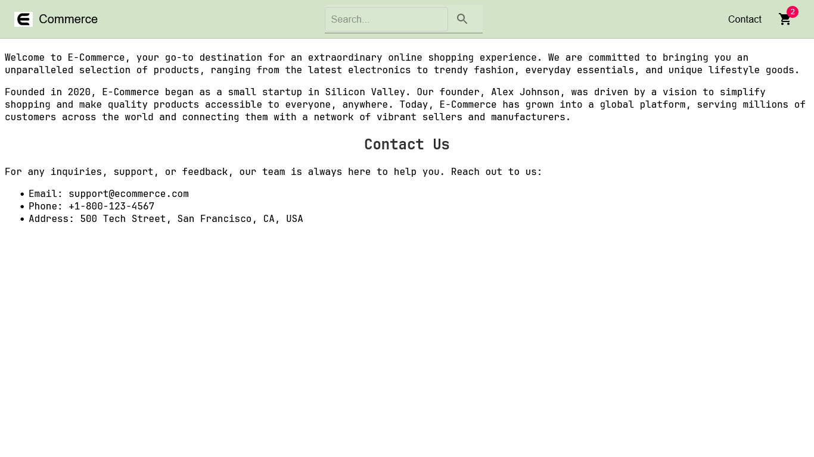
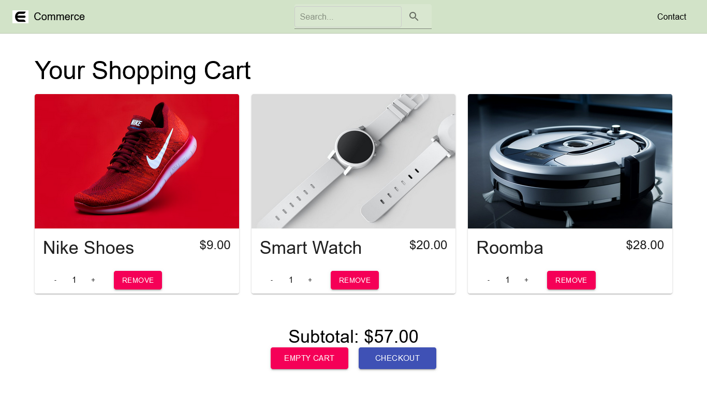
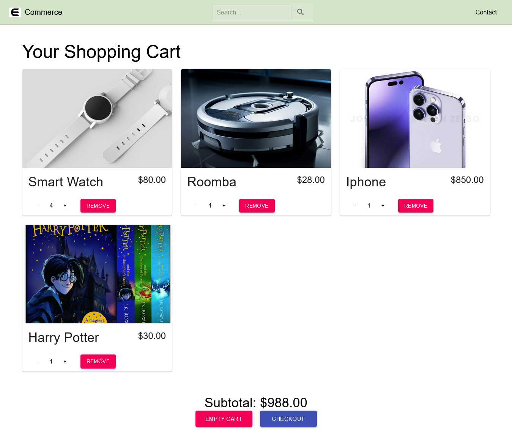
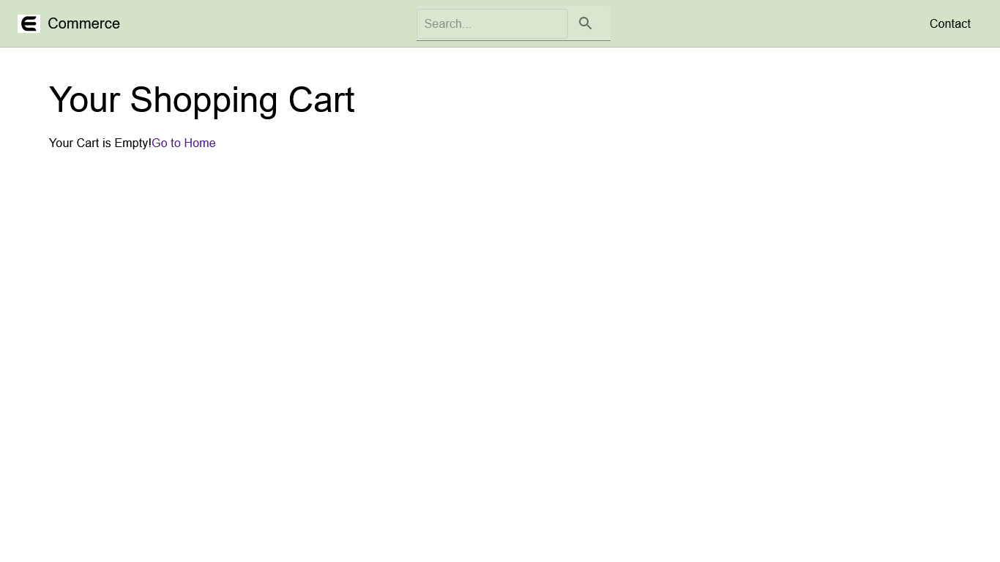
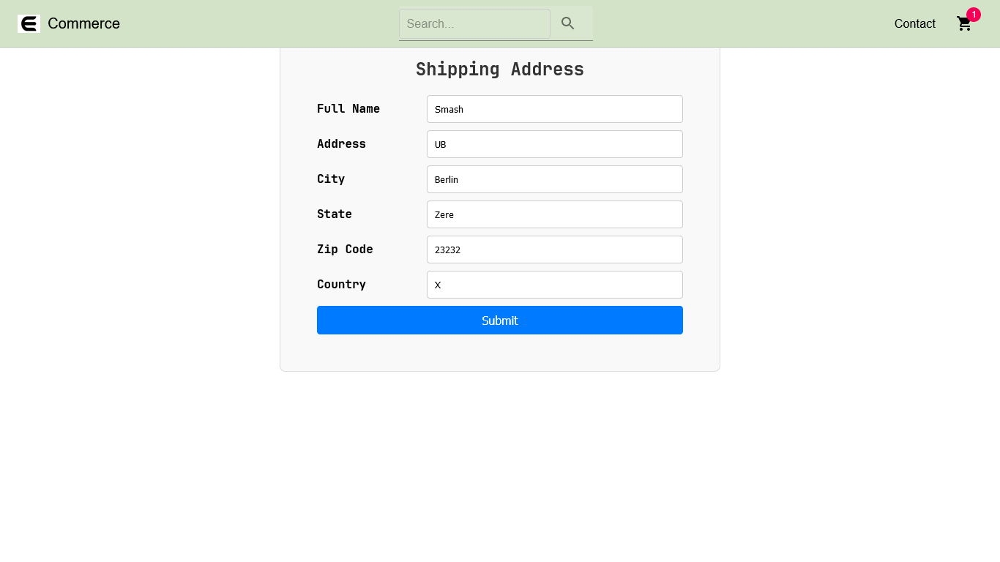
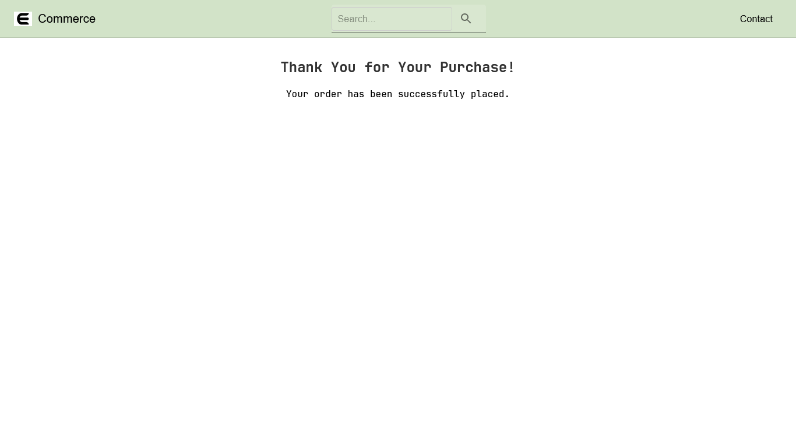

E-Commerce Project

Project Overview

This project is a fully functional, real-time e-commerce website built with ReactJS and Material-UI, leveraging the Commerce.js API for product data. It's designed to provide a seamless and responsive user experience for shopping online, showcasing a variety of products.
Key Features

    Real-Time Product Listings: Utilizes Commerce.js API to fetch and display an up-to-date catalog of products.
    Shopping Cart Functionality: Users can add items to their cart, adjust quantity, and view cart contents.
    Responsive Design: Crafted using Material-UI, the site is responsive and offers an excellent user experience on both desktop and mobile devices.

Technologies Used

    ReactJS: A JavaScript library for building user interfaces.
    Material-UI: A popular React UI framework for a faster and easier web development.
    Commerce.js: A powerful eCommerce API for developers and businesses.

Running the Project

    Clone the repository to your local machine.
    Run npm install to install dependencies.
    Create a .env file and add your Commerce.js API keys.
    Run npm start to start the development server.

Screenshots:

